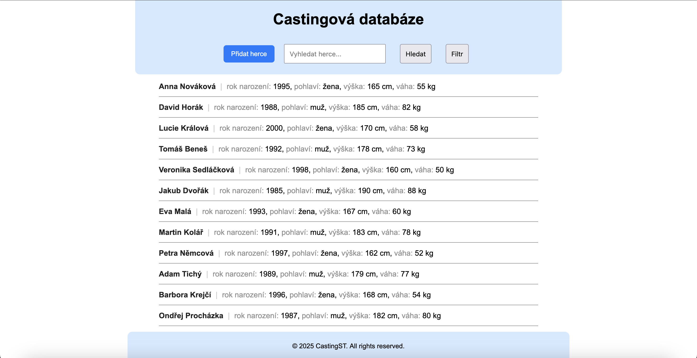
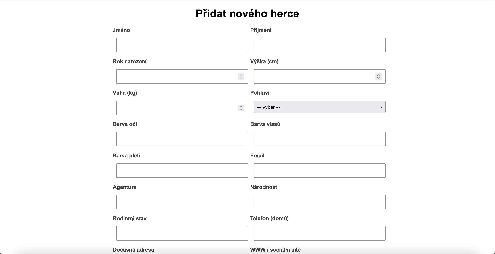
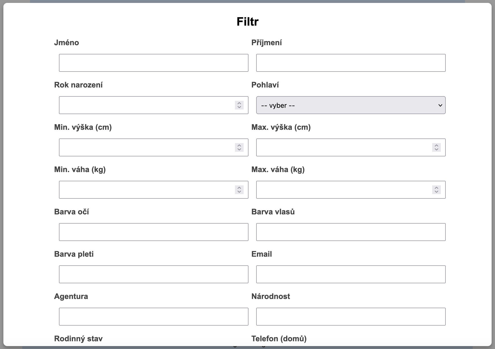
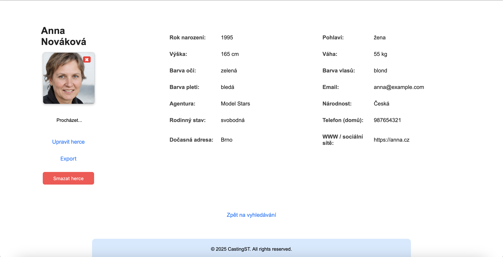
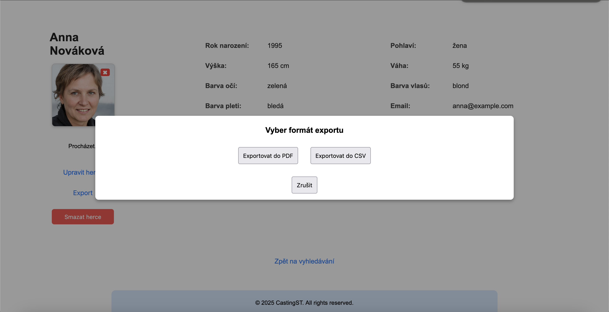
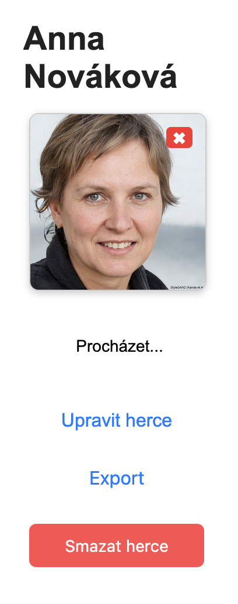

# Uživatelská příručka webové castingové databáze

Vítejte v uživatelské příručce k aplikaci. Tento dokument slouží jako přehled funkcí, ovládání a možností systému pro uživatele.

Tato aplikace je jednoduchý webový nástroj určený pro správu castingové databáze herců. Umožňuje:

- ukládat osobní a fyzické údaje herců,

- přidávat fotografie a videa,

- filtrovat podle různých parametrů (věk, výška, barva očí...),

- exportovat seznamy do PDF nebo CSV.

## Hlavní stránka

Po spuštění se zobrazí stránka s možností vyhledat herce, tlačítka "Přidat herce", "Hledat", "Filtr" a seznam všech herců v databázi. Každý herec je uveden v řádku se základními údaji:
- jméno a příjmení

- rok narození

- pohlaví

- výška a váha

Kliknutím na jméno se zobrazí karta herce s detaily.

## Přidání nového herce

Nového herce přidáte kliknutím na tlačítko „Přidat herce“. Zobrazí se formulář, kde vyplníte jméno, příjmení, kontakty, fyzické parametry atd.

Po odeslání bude herec přidán do databáze.

## Filtrování herců

Použitím filtru se seznam herců zúží dle zadaných kritérií. 
Kliknutím na tlačítko "Filtr" se otevře formulář s možností filtrovat herce podle:

- jména, příjmení

- výšky, váhy (včetně min/max)

- pohlaví, barvy vlasů, očí, národnosti atd.

## Karta herce

Detailová karta obsahuje kompletní profil herce:

- všechny atributy (včetně agentury, kontaktů, barvy pleti atd.)

- fotografie

- možnost úpravy údajů

- možnost exportovat do PDF nebo CSV

- tlačítko pro smazání herce

## Export dat
Systém umožňuje export herců několika způsoby:

- Detail herce: Lze exportovat do PDF nebo CSV přímo z jeho karty.

- Filtrování: Po aplikaci filtru je možné exportovat výsledky do CSV tlačítkem "Exportovat seznam do CSV".

Exporty slouží např. pro tisk, sdílení s produkcí nebo zálohování.

## Úprava a mazání herce

V detailu každého herce je možné:

- upravit jakékoli údaje (přes tlačítko „Upravit herce“)

- smazat herce (s potvrzením)

- smazat fotografie kliknutím na červený křížek u fotky

